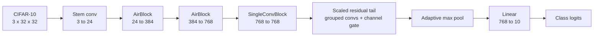

# UltraWideScaledTail10 — Depth-Limited CIFAR-10

A CIFAR-10 classifier built under a hard architectural constraint: **at most 10 weighted layers**
(`Conv1d`, `Conv2d`, `Linear`) on the forward path, with training time and hardware unconstrained.

The interesting question is not "how accurate can a CNN get on CIFAR-10" — it is **where you spend
ten layers when ten layers is all you get.**

## Result

| Metric | Value |
| --- | --- |
| Out-of-sample validation accuracy | **96.84% ± 0.10** (8 seeds) |
| Best single seed | 96.98% |
| Weighted layers | 10 / 10 (at budget) |
| Parameters | 21,337,656 |
| Schedule | 750 epochs × 8 seeds (42–49) |
| Compute | 12.4 GPU-hours, 8× A40 |

Per-seed results are in [`summary.csv`](summary.csv); full logs in `full_8seed_run.log`.

> **On the metric:** the headline number is *out-of-sample validation* accuracy, selected by
> checkpoint (raw or EMA) per seed. Official held-out test accuracy was recorded for earlier
> variants (94.52–95.14%) but is not recorded for the final model in this repo. Reported as
> validation, deliberately.

## The constraint

Normalization, activation, pooling, residual addition, stochastic depth, and channel gating are
*not* counted as weighted layers. That asymmetry is the entire design space: every `Conv2d` costs
10% of the budget, while a `ChannelGate` or `DropPath` costs nothing.

So the model spends its ten layers on width, and buys everything else with parameter-light
components that do not count against the budget.



### Layer audit

| # | Module | Type |
| ---: | --- | --- |
| 1 | `stem` | Conv2d |
| 2–3 | `block1.conv1`, `block1.conv2` | Conv2d |
| 4–5 | `block2.conv1`, `block2.conv2` | Conv2d |
| 6 | `block3.conv` | Conv2d |
| 7–8 | `tail.conv1`, `tail.conv2` | Conv2d (grouped) |
| 9 | `tail.conv3` | Conv2d |
| 10 | `fc` | Linear |

## What worked

1. **Width over depth.** Under a 10-layer budget, depth is expensive — each convolution consumes
   10% of the path. The model goes wide instead: 384 channels by the first block, 768 by the
   second. The narrower-but-deeper `DeepScaled10` scored 96.37% against this model's 96.97% on
   matched 3-seed screens.
2. **Compute in the low-resolution tail.** Three of the ten counted layers sit *after* pooling,
   where they refine features at a fraction of the cost of operating at 32×32.
3. **Free components.** `ChannelGate` recalibrates channel responses, `DropPath` regularizes the
   residual tail, and `BNBias` + GELU improve optimization — none of which consume layer budget.
4. **Training recipe.** Dirac initialization, RandAugment, random erasing, mixup, label smoothing,
   SGD with Nesterov momentum, cosine warmup, EMA checkpointing, AMP, channels-last.

Best checkpoints landed at epochs 459–486 on the 500-epoch screens — still improving at the end,
which is why the final schedule was extended to 750.

## What did not work

Twelve directions were tried and rejected. Selected results:

| Attempt | Outcome |
| --- | --- |
| `DeepScaled10` | 96.37% — depth-first lost to width-first under the same budget |
| `WideScaledPlus10` | 96.70% — close, but consistently behind |
| Parameter-efficient variant | 5.20M params vs 21.3M, but capacity loss cost accuracy |
| `GhostScaled10` | 94.52% official test — compact module insufficient |
| `CoordAtt10` | 94.52% official test — coordinate attention did not transfer |
| Feature-concat ensemble | 28 counted modules — violated the single-model 10-layer rule |
| Weighted logit ensemble | Improved complementarity, but multi-model and out of budget |

The consistent signal: neither maximum architectural novelty nor minimum parameter count won.
Wide feature extraction plus a low-resolution residual tail did.

Full table of all twelve, with rationale, is in [`FINAL_REPORT_DRAFT.md`](FINAL_REPORT_DRAFT.md).

## Reproducing

Full run — 8 seeds × 750 epochs, configured at the top of the training script:

```bash
python train_ultrawidescaledtail10_repro.py
```

Faster verification — reduce the seed list in the top-of-file config:

```python
RUN_SEEDS = (42, 43, 44)
```

Smoke test only (verifies the pipeline, **not** accuracy):

```python
RUN_EPOCHS = 1
RUN_MAX_TRAIN_BATCHES = 1
```

`RUN_PARALLEL_SEED_WORKERS = "auto"` resolves to one seed per GPU on multi-GPU hosts, and to a
single worker on one GPU to avoid VRAM contention. Outputs land in
`repro_runs_ultrawidescaledtail10_8seed/` with per-seed checkpoints, JSON logs, and aggregate
`summary.csv` / `summary.json`.

## Repository layout

| Path | Contents |
| --- | --- |
| `train_ultrawidescaledtail10_repro.py` | Training script, top-of-file configuration |
| `hunter29_top3_depth_limited_models.ipynb` | Model selection, layer audit, reproducibility config |
| `FINAL_REPORT_DRAFT.md` | Full technical report |
| `FINAL_REPORT_SUMMARY.tex` / `cse433finalprojectsummary.pdf` | Formatted report |
| `summary.csv` | Per-seed results, 8×750 run |
| `local_smoke_repro_runs/` | 3-seed pipeline verification (not accuracy evidence) |
| `run_full_{5,8,16}seed.py` | Seed-count run configurations |

---

CSE 433 final project, Miami University.
