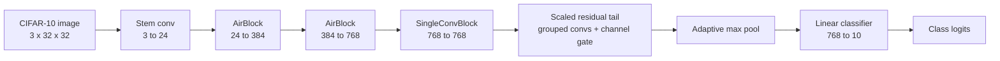

# UltraWideScaledTail10 CIFAR-10 Report Draft

_CSE 433 final project draft, focused on the selected best single depth-limited model._

---

## Rubric alignment

| Report requirement | Where addressed |
| --- | --- |
| Clear instructions/descriptions of the model and performance analysis, 15 pts | Model description, run instructions, performance analysis |
| Clear description and discussion of how and why the model was improved, 5 pts | Improvement rationale |
| Efforts that failed to improve accuracy, at least 10 methods, 10 pts | Failed and rejected improvement attempts |

## Model description

The selected model is `UltraWideScaledTail10`, implemented in `train_ultrawidescaledtail10_repro.py`.
The assignment allows at most ten weighted layers on the forward path: `Conv1d`, `Conv2d`, and `Linear` modules.
It excludes normalization, activation, pooling, residual addition, stochastic depth, and channel gating from that count.

The model builds wide feature maps, reduces their spatial size, and applies a residual tail after pooling.
This places three tail convolutions at a lower spatial resolution while keeping the ten-layer budget.



The counted layer audit is:

| Count | Module | Type | Notes |
| ---: | --- | --- | --- |
| 1 | `stem` | Conv2d | Initial image projection |
| 2 | `block1.conv1` | Conv2d | Wide feature block |
| 3 | `block1.conv2` | Conv2d | Wide feature block |
| 4 | `block2.conv1` | Conv2d | 768-channel feature block |
| 5 | `block2.conv2` | Conv2d | 768-channel feature block |
| 6 | `block3.conv` | Conv2d | Single low-resolution block |
| 7 | `tail.conv1` | Conv2d | Grouped tail convolution |
| 8 | `tail.conv2` | Conv2d | Grouped tail convolution |
| 9 | `tail.conv3` | Conv2d | Dense tail convolution |
| 10 | `fc` | Linear | Final classifier |

The model has ten counted layers and 21,337,656 parameters.
The recorded dummy forward pass returned logits with shape `(2, 10)`.

## Run instructions

Review the top-of-file configuration before running:

```powershell
python train_ultrawidescaledtail10_repro.py
```

The default trains seeds 42 through 49 for 750 epochs each.
It writes per-seed checkpoints and logs under `repro_runs_ultrawidescaledtail10_8seed/`, followed by `summary.csv` and `summary.json`.
Automatic worker selection assigns one seed per available GPU, within the seed count.
The recorded full run used eight A40 GPUs. A single GPU can run seeds in sequence.

For a pipeline smoke check, temporarily set:

```python
RUN_SEEDS = (42,)
RUN_EPOCHS = 1
RUN_MAX_TRAIN_BATCHES = 1
```

These settings check data loading, model execution, checkpoint saving, and summary writing. They cannot reproduce the reported accuracy.

## Recorded smoke check

The earlier Windows smoke run used cached CIFAR-10 data, three seeds, one epoch, and one training batch per seed.
It used a GeForce RTX 5070. The training path supports CUDA autocast, channels-last tensors, and data-loader workers.

| Seed | Epochs | Selected validation accuracy | Best raw | Best EMA | Wall minutes |
| ---: | ---: | ---: | ---: | ---: | ---: |
| 42 | 1 | 10.60 | 10.60 | 10.60 | 0.038 |
| 43 | 1 | 7.18 | 7.18 | 7.18 | 0.022 |
| 44 | 1 | 10.34 | 10.34 | 10.34 | 0.023 |

The smoke summary records 9.37% mean selected validation accuracy with a 1.90 percentage-point standard deviation.

## Performance analysis

The earlier 500-epoch runs compared three architectures on the validation set.
`UltraWideScaledTail10` had the highest mean selected validation accuracy in those records.
Repeated architecture and checkpoint selection can bias validation scores upward.

| Model | Seeds | Mean selected validation | Std | Max | Layers |
| --- | ---: | ---: | ---: | ---: | ---: |
| UltraWideScaledTail10 | 3 | 96.97 | 0.08 | 97.06 | 10 |
| WideScaledPlus10 | 3 | 96.70 | 0.14 | 96.80 | 10 |
| DeepScaled10 | 3 | 96.37 | 0.14 | 96.52 | 10 |

The retained per-seed results are:

| Seed | Selected validation | Best raw | Best EMA | Selected epoch |
| ---: | ---: | ---: | ---: | ---: |
| 42 | 96.94 | 96.88 | 96.94 | 459 |
| 43 | 97.06 | 97.06 | 97.02 | 481 |
| 44 | 96.90 | 96.90 | 96.90 | 486 |

The late selected checkpoints motivated a 750-epoch follow-up across eight seeds.
The [final CSV](../results/eight-seed/summary.csv) records a mean selected validation accuracy of 96.84%, with sample standard deviation 0.10 percentage points.
Its best seed reaches 96.98%. The final model has no recorded official test accuracy in that CSV.

## Design choices

The architecture uses 384 channels in the first feature block and 768 channels in later blocks.
Pooling reduces the spatial cost of the residual tail.
`ChannelGate` adjusts channel responses without a counted convolution or linear layer.
`DropPath` regularizes the residual branch. `BNBias` and GELU operate outside the assignment depth count.

The training recipe includes crop and flip augmentation, RandAugment, random erasing, mixup, label smoothing, and momentum SGD.
It also uses cosine warmup scheduling, exponential-moving-average checkpoints, autocast, and channels-last layout.
The comparisons do not isolate the effect of each component. They support selection among these tested configurations, not a universal architecture ranking.

## Failed and rejected improvement attempts

The record includes architecture comparisons, historical results, and rejected submission formats.
Several rows describe related design choices, so this list does not represent twelve independent controlled experiments.
Official test scores for older models are not directly comparable with selected validation scores for the final model.

| # | Attempt | Result and reason it was not selected |
| ---: | --- | --- |
| 1 | `DeepScaled10` | Lower prior 3-seed mean validation accuracy, 96.37 vs 96.97 for `UltraWideScaledTail10`. |
| 2 | `WideScaledPlus10` | Strong but still lower prior 3-seed mean validation accuracy, 96.70 vs 96.97. |
| 3 | Plain deeper scaling | Depth alone did not beat the width-first design under the 10-layer budget. `DeepScaled10` is the clearest example. |
| 4 | Parameter-efficient smaller model preference | `DeepScaled10` used far fewer parameters, about 5.20M, but the reduced capacity cost validation accuracy. |
| 5 | Historical `UltraWide7` | Older 7-layer style result reached 95.14 official test accuracy, from an earlier evaluation. |
| 6 | Historical `WideScaled10` | Earlier width-plus-tail version reached 94.83 official test accuracy, from an earlier evaluation. |
| 7 | `GhostScaled10` | Compact ghost-style module reached 94.52 official test accuracy, from an earlier evaluation. |
| 8 | `CoordAtt10` | Coordinate-attention style module reached 94.52 official test accuracy, from an earlier evaluation. |
| 9 | Learned feature-concatenation ensemble | A unified ensemble head over three feature extractors was not a valid single 10-layer model; the counted parameter modules reached 28 total modules. |
| 10 | Weighted logit ensemble | A Wilson-weighted ensemble improved complementarity but was rejected because it combined multiple models and exceeded the single-model depth budget. |
| 11 | Keeping all top-three models in the final notebook | The final notebook retains one architecture to meet the single-model submission requirement. |
| 12 | Shorter training screens as final evidence | The selected prior checkpoints occurred around epochs 459 to 486, so short runs were useful for screening but not sufficient for final reproducibility evidence. |

## Artifacts

| Artifact | Purpose |
| --- | --- |
| `hunter29_top3_depth_limited_models.ipynb` | Notebook with the selected model, audit, and reproducibility configuration |
| `train_ultrawidescaledtail10_repro.py` | Single-model training script with top-of-file configuration |
| `results/smoke/summary.csv` | Local 3-seed smoke-test summary |
| `results/smoke/summary.json` | Local 3-seed smoke-test detailed summary |

The run instructions above preserve the original configuration. The current [launcher guide](runpod.md) uses one CLI for all seed counts.
